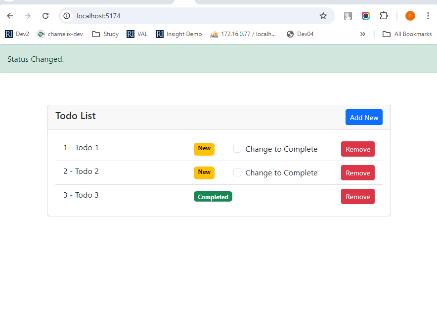

### Project Description: Sample To-Do App

This is a sample **To-Do App** built with **React** and powered by **Vite** as the project setup. The application allows users to manage their tasks by creating, marking as completed, and deleting to-dos. The app leverages **local storage** to persist data, ensuring that tasks are stored and retrieved across page reloads.

#### Features:
- **Add New To-Do:** Users can add new tasks, which are automatically assigned a unique ID and displayed in the to-do list.
- **Mark as Completed:** Users can mark tasks as completed, and these tasks will reflect their completed status.
- **Delete To-Do:** Users can remove tasks from the list.
- **Persist Data in Local Storage:** All tasks are stored in the browser's local storage, allowing the app to retrieve and display the to-do list even after a page reload or browser restart.

#### Technologies Used:
- **React (Vite-based setup)**: A JavaScript library for building user interfaces, set up using Vite for faster development.
- **Local Storage**: To store and retrieve to-do items across sessions.
- **Bootstrap**: For basic styling and responsive design.

#### How to Run the Project:
1. Clone the repository and navigate to the project folder.
2. Install dependencies using:
   ```bash
   npm install
   ```
3. Start the development server with:
   ```bash
   npm run dev
   ```
4. The app will run locally, and you can access it by visiting `http://localhost:3000` in your browser.

This is a simple project demonstrating state management, data persistence with local storage, and component-based architecture in React.

